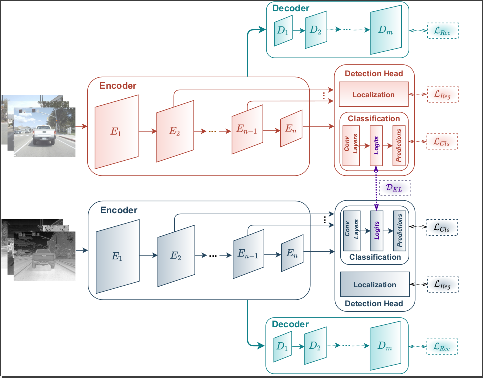
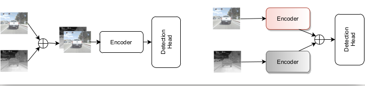

# MultiModal-Collaborative (MMC) Learning Framework for integrating RGB and Thermal spectral modalities


This is the official code for NeurIPS 2021 Machine Learning for Autonomous Driving Workshop
Paper, "Does Thermal data make the detection systems more reliable?" by Shruthi Gowda, Elahe Arani and Bahram Zonooz.

## Methodology

#### Architecture
```
Detection Head : SSD
Detection Backbone : Resnet (CNN-based) or DEiT (Transformer-based)
```
#### MMC framework


MMC framework has multiple versions
```
KD.ENABLE: True
KD.ENABLE_DML: True

1. MMC (Base Version) : Det Loss + DML Loss 
    KD.DISTILL_TYPE : KL, AT, L2, L2B
    KL (KL divergence), AT (Attention loss), L2 (L2 norm at head layer), L2B (L2 norm of backbone features)
   
2. MMC v1 (Reconstruction) : Det Loss + DML Loss + Recon Loss
    KD.AUX_RECON = True
    KD.AUX_RECON_MODE = "normal"

3. MMC v2 (Cross Reconstruction) : Det Loss + DML Loss + Cross Recon Loss
    KD.AUX_RECON = True
    KD.AUX_RECON_MODE = "cross"
```
We also try other techniques for comparison


```
Fusion
1. Input Fusion
    KD.CONCAT_INPUT
2. Feature Fusion
    KD.CONCAT_FEATURES
    CONCAT_LAYERS
```


## Installation 
You can prepare the environment using:
```
pip install -r requirements.txt
```

You can build the project using the following script:
```
./build {conda_env_name}
```

## Datasets 
Two datasets "FLIR" and "KAIST" are used in this repo
```
FLIR : https://www.flir.eu/oem/adas/adas-dataset-form/
```
```
KAIST : https://soonminhwang.github.io/rgbt-ped-detection/
```

## Running 

#### Train
There are 2 networks, one receiving RGB images and one receiving thermal images. Both require different config files.

```
python train.py --config-file <thermal-config-file> --teacher-config-file <rgb-config-file>
```

#### Test
For evaluation only one network is used - the first network (RGB or Teacher network)
```
python test.py --config-file <config-file> --ckpt <model_final.pth> 
```

#### Model Checkpoints

## Cite Our Work

## License

This project is licensed under the terms of the MIT license.

